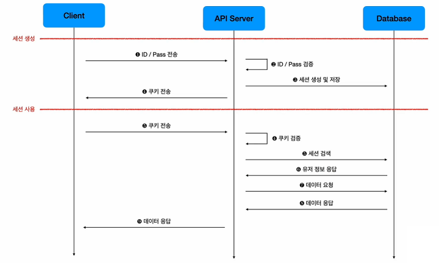
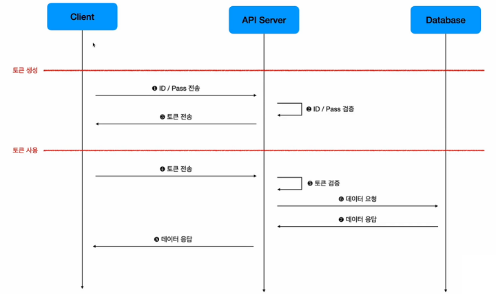
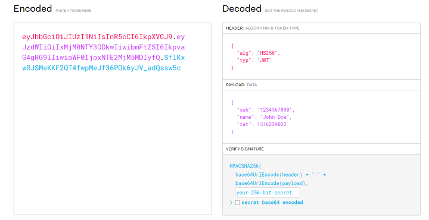
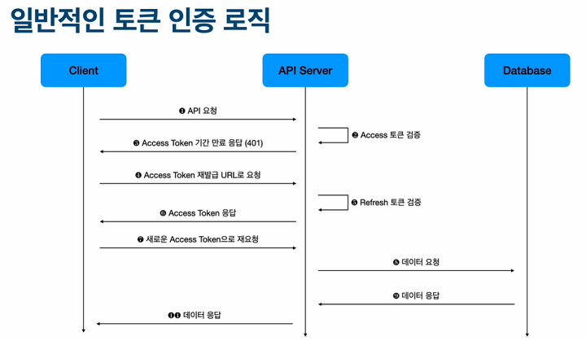

# Seesion, Token, 로그인 로직 정리

## Session
* 유저의 정보를 DB에 저장하고 상태를 유지하는 도구
* 특수한 Session ID 값으로 구성
* 서버에서 생성 클라이언트에 쿠키를 통해 저장
* 장점 : 서버에서 데이터가 저장되기 때문에 클라이언트에서 세션정보가 노출되어도 위험x
* 단점 : 매요청마다 DB에서 Session ID를 확인해야함
* DB에 Session을 저장해야해서 horizontal scailing에 불리

## Token
* 유저의 정보를 Base64로 인코딩된 String 값에 저장하는 도구
* Header, Payload, Signature로 구성하여 Base64로 인코딩
* 서버에서 생성 클라이언트에 저장
* 장점 : Token은 DB에 저장되지 않고 signature값을 이용해서 검증, 검증할때마다 DB를 매번 볼 필요가 없다.
* 단점 : 정보가 모두 Token에 담겨, 클라이언트에서 정보 유출의 위험o
* DB에 저장을 안하기에 horizontal scailing에 유리
* 같은 이유로 MSA 처럼 분산화된 시스템에서는 주로 Token 사용

## Session 흐름

## Token 흐름

## JWT
* JSON Web Token
* Header, Payload, Signature로 구성
* Base64로 인코딩
* Header : 토큰에 대한 정보 (토큰의 종류와 암호화 알고리즘 등) 
* Payload : 사용자 검증에 필요한 정보 (발행일, 만료일, 사용자 ID 등)
* 3개중 하나라도 바뀌면 싸이닝된 jwt 반환 값이 바뀜
* 싸이닝 된 jwt 값이 모두 일치해야지만 위조 되지 않았다고 판단

## AccessToken, RefreshToken
* JWT 기반 토큰
* AccessToken은 API 요청할 때의 검증용 토큰
  * [Header] authorization : "Bearer $accessToken
  * 인증이 필요한 기능의 경우 Header에 AccessToken을 담아서 요청
  * 유효기간이 짧다
* RefreshToken은 AccessToken 을 추가 발급시 사용
  * [Header] authorization : "Bearer $refreshToken
  * AccessToken의 유효기간이 만료된 경우 RefreshToken을 이용해 재발급
  * 유효기간이 길다
* RefreshToken도 만료되면 해당 계정 로그오프 후, 다시 로그인시켜 token 재발급
* 그래서 평소에 로그인 정보 만료된 상황이 위의 경우

## Token 인증 로직

