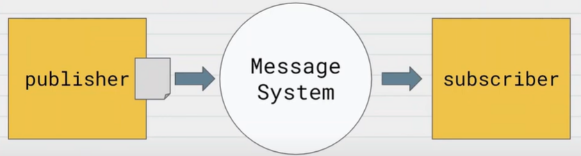

## 메시지 시스템

* publisher는 메시지를 생성하고 메시지 큐에 전송하는 client
* 메시지를 큐에 전송하는 것을 **publish** 라고 함
* subscriber는 메시지 큐에서 메시지를 받는 client
* 메시지를 큐에서 가져오는 것을 **consume** 이라고 함
* 단방향 : publisher -> MessageSystem -> subscriber
* producer, comsumer 으로도 사용
* spring에서는 ApplicaionEvent, EventListener 사용

## 기능
* 서버에 대량의 요청이 한번에 들어왔을 때 어떻게 처리할 것인가
* 유저의 요청을 큐에 담아두고, 서버가 처리할 수 있을 때 데이터 처리
* 메세지는 삭제, 이벤트는 유지
* 이벤트 브로커는 메시지 브로커의 역할도 수행 가능

## 1. 메시지 브로커
* 메시지 큐를 이용해 데이터를 비동기 처리
* 메시지를 받아 처리후 메시지 삭제
* 손실되는 안되는 요청을 처리시 주의
* RabbitMQ, Redis

### 1-1 RabbitMQ
* 오픈 소스 메시지 브로커 소프트웨어
* 메세지큐 생성, 삭제, 라우팅에 유연
* AMQP (Advanced Message Queuing Protocol) 구현

### 1-2 Redis
* 메모리 기반의 딕셔너리 자료 구조 관리
* key-value 구조의 비정형 데이터  관리
* 사용자가 많은 서비스에서 캐시 역할로 사용
* single thread 기반
* 한 번에 하나의 명령만 처리

## 2. 이벤트 브로커
* 이벤트를 받아 처리후 이벤트는 유지
* 메시지 브로커의 역할도 수행 가능
* 손실되면 안되는 요청을 처리할 때 좋음

### 2-1 kafka
* 오픈 소스 이벤트 브로커
* 디스크 사용
* 대규모 메시지 처리
* 대량의 배치작업