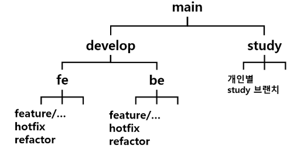

# 당신의 안전한 귀가를 위해 🌛마중⭐


### [메인 기능]
🟦 최단경로 / 안심경로 제공

> 최단경로 뿐만아니라 치안시설물 기반으로 제공되는 안심경로를 이용해보세요.

🟦 실시간 위치 공유
> 현재 위치를 보호자에게 실시간으로 공유해보세요.

🟦 바디캠 녹화 및 공유
> 영상을 녹화하고 저장할 수 있습니다.
> 보호자는 마중 요청자의 바디캠을 확인할 수 있습니다.
> 영상은 일정기간이 지나면 녹화목록에서 자동으로 삭제됩니다.

🟦 시설물 미비 지역 확인
> 치안 시설물 기반으로 어둡고 위험할 수 있는 지역을 표시합니다.

### [기타 기능]
🟦 회원가입 & 소셜 로그인
> KAKAO 로그인으로 손쉽게 마중을 이용해보세요.

🟦 치안시설물 정보 확인
> CCTV, 가로등, 경찰서, 편의점, 안심귀갓길, 비상벨 등 치안 시설물 정보를 확인해보세요.

🟦 리뷰
> 현재 위치에 대한 리뷰를 남겨주세요.
> 밝기, 인적, 사진, 글을 입력할 수 있습니다.
> 다른 사용자들과 위치에 대한 정보를 공유해보세요.

🟦 즐겨찾기
> 자주 가는 위치를 즐겨찾기에 등록해보세요.

🟦 친구 및 보호자 등록
> 휴대폰 번호를 통해 친구를 등록할 수 있습니다.
> 보호자로 등록해서 실시간 위치를 공유하고, 바디캠을 공유하세요~

🟦 호루라기
> 호루라기 버튼으로 주변에 위험상황을 알리세요!

🟦 비상신고 / 대리신고
> 경찰에게 현재 위치 정보를 담은 메시지를 보내세요!
> 보호자는 대리 신고 기능을 경찰에게 신고할 수 있습니다.

---


## 팀 협업 컨벤션


### Git 활용

#### 🧀 1. git 규칙

```markdown
1. 자신이 담당한 부분 이외에 다른 팀원이 담당한 부분을 수정할 때에는 MM을 통해 변경 사항을 전달한다.
2. 본인의 Merge Request는 본인이 Merge한다.
3. 빠른 협업 속도를 위해 Merge Request가 올라온 이후 24시간 내에 Code Review를 수행한다.
4. Commit, Push, Merge, Merge Request 등 모든 작업은 앱이 정상적으로 실행되는 지 확인 후 수행한다.
```

#### 🧀 2. 깃 플로우



```
1. jira의 story에서 Create branch를 클릭해 브랜치를 생성한다.
2. 안드로이드 팀의 경우 Source를 fe로, 서버 팀의 경우 Source를 be로 선택한다.
3. branch name에 prefix는 그대로 두고 뒤에 **feat/성/기능이름**을 작성한다. 
   (예시 : feat/oh/my_page_api)
4. Add - Commit - Push - Merge Request 의 과정을 거친다.
5. Merge Request가 작성되면 작성자 이외의 다른 팀원이 Code Review를 한다.
6. Code Review가 완료되면 Merge Request 작성자가 FE 또는 BE 브랜치로 merge 한다.
```

#### 🧀 3. commit 규칙

```markdown
      v   v v
**[FEAT] @id - 메시지**

메시지는 한글로 작성
```

```markdown
- FEAT : 새로운 기능 구현
- FIX : 버그, 오류 해결
- UI : 안드로이드 UI 코드만 추가한 경우
- RESOLVE : Conflict 해결한 경우
- ADD : Feat 이외의 부수적인 코드 등 추가
- STYLE : 코드를 수정한 경우
- DEL : 쓸모없는 코드 삭제
- CHORE : 그 이외의 잡일/ 버전 코드 수정, 패키지 구조 변경, 파일 이동, 가독성이나 변수명, reformat 등
- REFACTOR : 내부 로직은 변경 하지 않고 기존의 코드를 개선하는 리팩토링 시
- RENAME : 파일명이나 폴더명을 수정만 한 경우
- DOCS : README나 WIKI 등의 문서 개정
- STUDY : Study branch에 공부한 내용을 커밋하는 경우
- TEST : 테스트 코드 추가
- MEARGE : 
```

#### 🧀 4. Merge Request 규칙

```
1. Merge Request는 feature 단위 작업이 끝나면 fe/be 브랜치로 올립니다.
2. Source Branch는 작업이 끝난 feature 단위 브랜치, Target Branch는 fe/be 브랜치를 선택합니다.
3. Title은 gitlab에서 생성해주는 그대로 작성하되 맨 앞에 #Done을 붙이고, Description은 해당 브랜치에서 작업한 내용을 작성합니다.
4. Asignee에 자신을, Reviewer에는 코드리뷰 담당자를 선택합니다.
```


### Jira 활용

#### 🧀 1. 워크플로우(Work Flow)

```markdown
1. 이슈 생성
2. 백로그에 이슈 등록
3. 스프린트 생성하기
4. 백로그에 있는 이슈 스프린트로 옮기기
5. 스프린트 시작하기
6. 스프린트 종료 및 회고
```