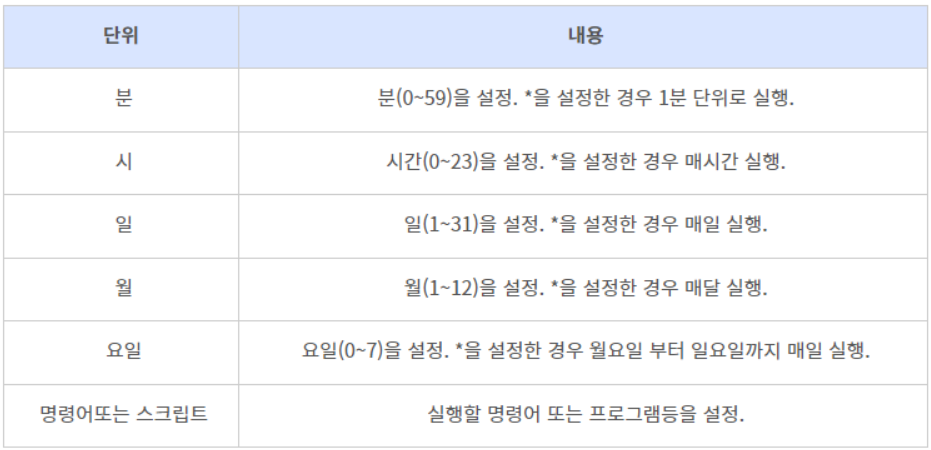

### 프로세스 예약 실행 (일회성)

at 명령어

---


### 프로세스 예약 실행 (주기성)

크론 (cron)

- 미리 정한 시간에 명령어, 프로그램, 작업 등을 실행할 수 있는 서비스

- at 명령어는 단 1회만 예약시간에 작업 실행하는 반면

  크론 서비스는 반복적으로 실행할 수 있음

- 크론 데몬 cron와 예약작업 정보가 담겨있는 설정파일로 구성


크론탭 (crontab)

- cron은 정해진 스케쥴에 따라 작업을 수행하는 데몬
- crontab은 데몬이 바라보는 작업 리스트

- cron 프로세스는 /etc/crontab 파일에 설정된 것을 읽어서 작업을 수행하게 된다.


anacron

- /usr/sbin/anacron 에 위치하며,

  크론과 같이 동작하는 프로그램으로 서버가 일정 시간 중지되었을 때에도 작업이 실행되는 것을 보장하기 위해 사용하는 도구이다.\

---

### crontab 파일 형식

크론설정파일에 크론작업을 정의한다.

총 7개의 필드로 구성되어 있다.

분, 시간, 일, 월, 요일, 사용자명, 실행할 명령어 순으로 기재한다.

```
20 5 10 * * root /usr/sbin/test
```

10일 5시 20분에 root 사용자의 test 실행


Tip: 요일의 경우 일(0,7), 월(1), 화(2), 수(3), 목(4), 금(5)





### crontab 수정

```
crontab -e
```


### crontab 재시작

crontab 설정 변경 후 항상 cron 서비스를 재시작 해야한다.

```
service cron status # 동작 여부 확인

service cron start	# 가동
service cron restart # 재가동

# cron 명령어가 안되면 crond로 실행
```


### crontab 등록된 목록보기

```
crontab -l
```


### cron 로깅

```
* * * * * /home/script/test.sh > /home/script/test.sh.log 2>&1
```

