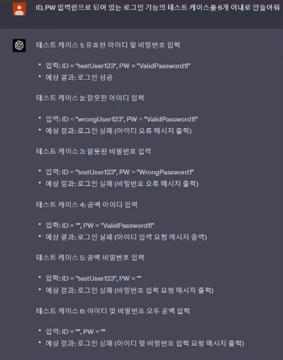
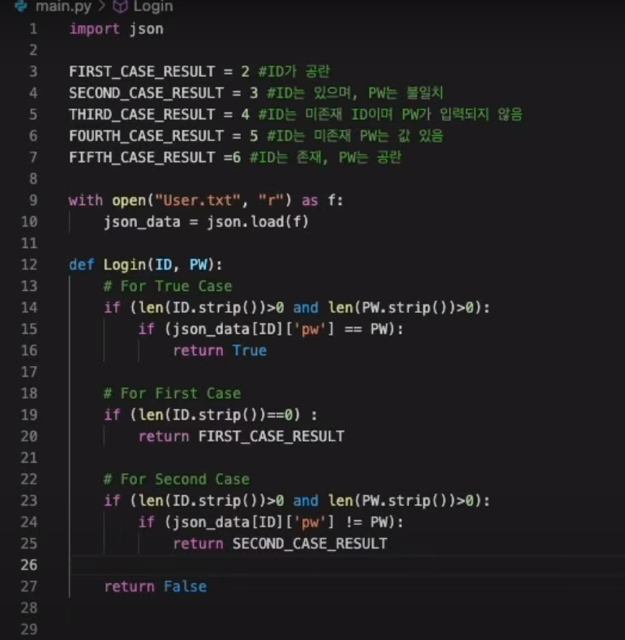
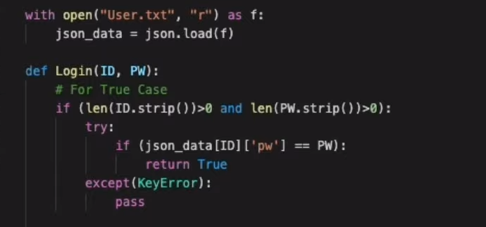
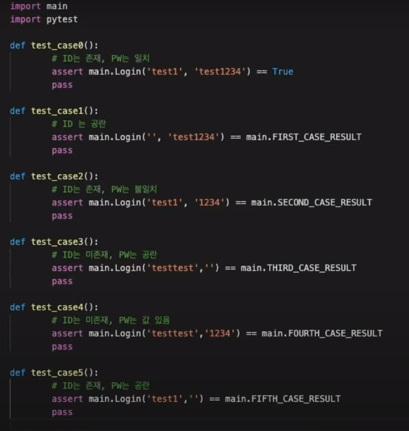

로그인 함수를 TDD로 만들어보자

- 몇 개의, 어떤 케이스가 필요할까?
  - ChatGPT를 활용하는 것도 좋은 방법이다.
  - 

---
### main.py

---
### test.py

---

## TDD

장점

- 디자인 패턴을 의식하지 않고 어느 정도 이에 따른 코드 결과물을 만들 수 있다.
- 테스트 코드 고민이 줄어든다 (결정과 피드백의 거리가 좁아짐)

단점

- 테스트 케이스의 퀄리티에 따라 결과물이 달라진다
- 발상의 전환에 시간이 걸린다.