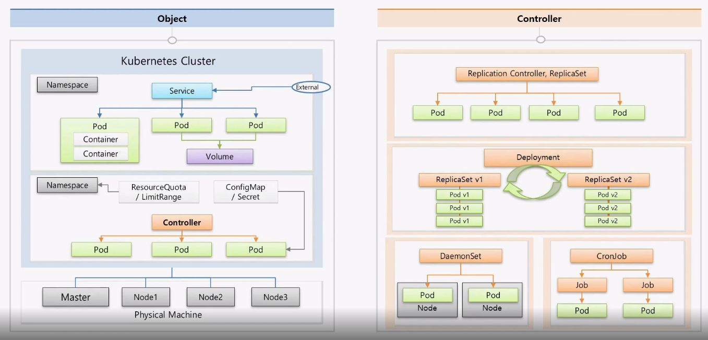

### Object

Master: Kubernetes의 전반적인 기능들을 제어하는 역할

Node: 자원을 제공하는 역할

Kubernetes Cluster: Master와 Node로 이루어짐

Namespace: Kubernetes Object들을 독립된 공간으로 분리되게 만들어준다.

- ResourceQuota / LimitRange: 한 Namespace에서 활용할 수 있는 파드의 개수나 자원의 양(CPU, Memory 등)을 한정시킬 수 있다.
- ConfigMap / Secret: 환경 변수 값을 넣는다던가 파일을 라우팅 해줄 수 있다.

Pod: Kubernetes의 최소 배포 단위, 하나 이상의 Container를 포함.

Service: Pod들에게 외부로부터 연결이 가능하도록 IP를 할당해줌(서로 다른 Namespace에 있는 Pod와는 무관)

Volume: Pod에 문제가 생기면 데이터가 휘발될 수 있음. 그럴 경우를 대비해서 Volume을 활용함

Controller: Pod 들을 관리해줌

### Controller

Replication Controller, ReplicaSet

- 가장 기본적인 컨트롤러
- 파드가 죽으면 감지해서 다시 되살림
- 파드의 개수를 늘리거나 줄일 수 있음

Deployment

- 배포 후에 파드들을 업그레이드 해줌
- 업그레이드 중 문제가 생기면 롤백을 시켜줌

DemonSet

- 한 노드에 파드가 하나씩만 유지가 되도록함 (이때 사용하는 특수한 모듈들이 있음)

CronJob

- 어떤 특정 작업만하고 종료를 시켜야할 때 활용